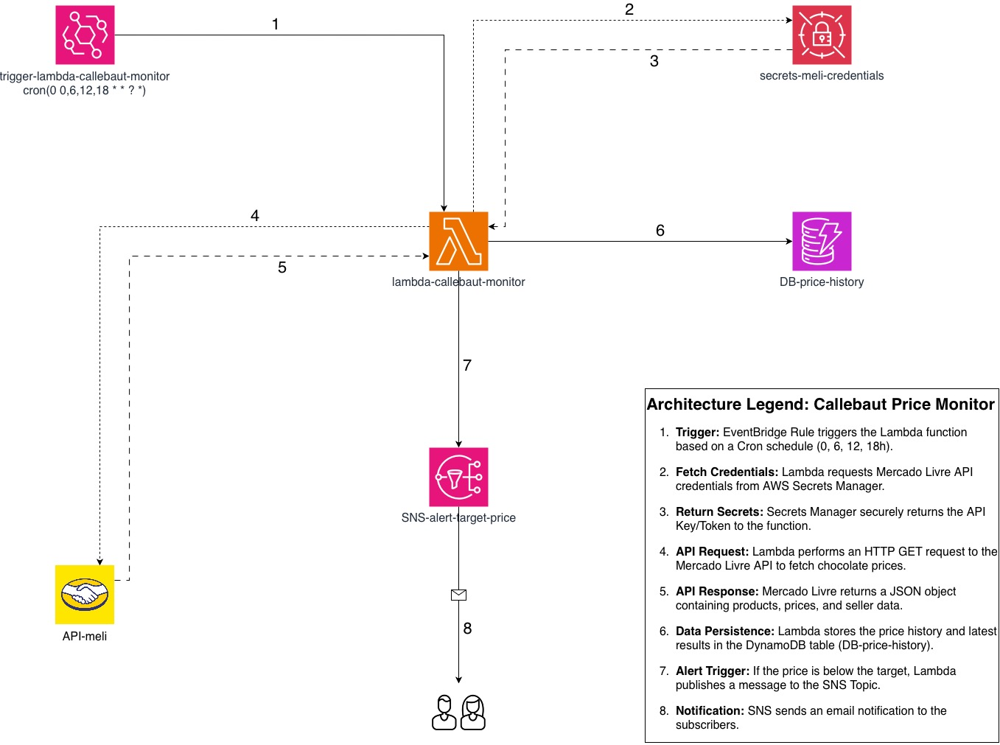

# 🍫 Callebaut Price Monitor (AWS Serverless)

Este projeto é uma ferramenta de monitoramento automatizado desenvolvida para rastrear o preço de chocolates Callebaut no Mercado Livre. O sistema utiliza uma arquitetura 100% Serverless na AWS para garantir baixo custo e alta disponibilidade.

## 🚀 Arquitetura

O sistema funciona através de um fluxo de eventos agendados que realizam a extração, filtragem e notificação de preços.

### Componentes Utilizados:
- **AWS Lambda**: Core do processamento (Python).
- **Amazon EventBridge**: Gatilho agendado (Cron: `0 0,6,12,18 * * ? *`).
- **AWS Secrets Manager**: Armazenamento seguro de credenciais da API do Mercado Livre.
- **Amazon DynamoDB**: Histórico de preços para análise de variação.
- **Amazon SNS**: Sistema de notificação por e-mail para alertas de promoção.
- **Mercado Livre API**: Fonte de dados dos produtos.

## 🛠️ Como Funciona (Step-by-Step)

1. **Trigger**: O EventBridge aciona a Lambda 4 vezes ao dia.
2. **Security**: A Lambda busca as chaves de API de forma segura no Secrets Manager.
3. **Extraction**: É feita uma requisição à API do Mercado Livre buscando itens específicos.
4. **Processing**: O código filtra por vendedores confiáveis (Platinum/Gold) e preços abaixo do alvo.
5. **Persistence**: Os dados são salvos no DynamoDB para gerar histórico.
6. **Alert**: Caso uma oferta real seja encontrada, um alerta é enviado via SNS para o e-mail cadastrado.

## 📈 Próximos Passos
- [ ] Implementar visualização de dados com Datadog.
- [ ] Adicionar suporte para múltiplos produtos simultâneos.

---
Projetado por Nayara